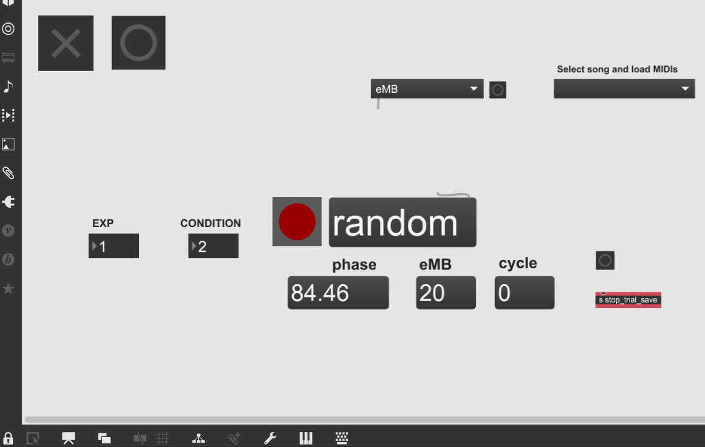
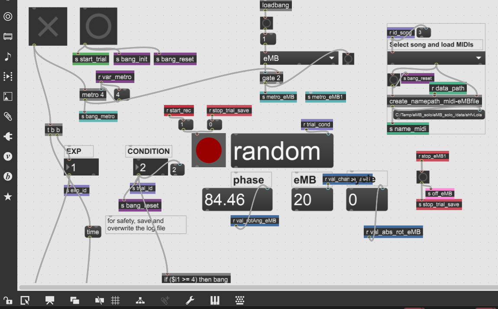

# eMB Roma — Max/MSP Projects

Max/MSP projects for real-time musical interaction and experimental control using the eMB Roma devices.

This repository contains two versions of the Max/MSP implementation:

```text
solo_eMB_maxMSP/
dual_eMB_maxMSP/
```

Both projects share the same software architecture and functionality as described in the article. The main difference is the number of supported eMB devices:

* `solo_eMB_maxMSP` → setup for one eMB
* `dual_eMB_maxMSP` → setup for two simultaneous eMBs

---

## Project Structure

```text
solo_eMB_maxMSP/
│
├── main.maxpat
├── config/
├── stimuli/
├── logs/
└── midi/


dual_eMB_maxMSP/
│
├── main.maxpat
├── config/
├── stimuli/
├── logs/
└── midi/
```

---

## Features

* Real-time eMB rotational data acquisition
* Musical stimulus playback
* MIDI generation from movement
* Experimental trial control
* Instrument mapping
* Behavioral data logging
* Optional synchronization triggers for external devices

Both versions support:

* configurable experimental trials
* polyphonic musical stimuli
* MIDI-derived text sequences
* external MIDI routing

---

## Running the Projects

1. Open the desired project:

   * `solo_eMB_maxMSP/main.maxpat`
   * `dual_eMB_maxMSP/main.maxpat`

2. Load:

   * global configuration file
   * experiment configuration file

3. Connect the eMB device(s)

4. Start DSP/audio

5. Press `Start Trial`

---

## Configuration Files

Each project uses two configuration files:

### Global Configuration

Defines:

* COM ports
* sampling rate
* paths
* instrument assignments
* trigger settings

### Experiment Configuration

Defines trial-specific parameters:

* song
* condition
* instrument mapping
* tempo
* metronome settings

---

## Musical Stimuli

Stimuli are stored as MIDI-derived text files:

```text
<song>_<instrument>.txt
```

Supported:

* monophonic and polyphonic sequences
* multiple instruments
* configurable mappings

---

## Outputs

Each trial generates:

* raw behavioral data logs
* MIDI output files
* optional summary logs

---

## Screenshots

### GUI Overview

* Graphical user interface view with MaxMSP locked, for easier visualization and interaction with the eMB Roma. Press X to start the eMB connection and O to start a trial after loading the experimental configuration file and corresponding  trial (and song).

```md

```

* View of hidden MaxMSP objects with unlocked view.

```md

```

---

### Configuration and initialization


```md

```

Block for loading paths, instruments and other initialization variables. 

---

### eMB angle and linear slider acquisition

Block that receives the eMB data and processes it following the logic described in the manuscript section 'Trial execution and data flow'.

```md

```
---

### Instrument mapping and playback

Example block for instrument 1 illustrating the data flow for mapping the eMB data into MIDI playback.

```md

```

---

### Data output and logging

Block that saves the eMB data into the raw data text file.

```md

```

Block that saves the MIDI file with polyphony, with each instrument on a different channel.

```md

```
---

### Synchronization with external devices

Example blocks for detecting annd sending triggers to an EEG serial COM port. 

```md

```
```md

```
---

## Notes

* Default discretization: 16 steps per rotation
* Default sampling rate: 200 Hz
* The dual version processes both eMBs independently in parallel
* Trigger outputs for EEG or external systems are optional

---
